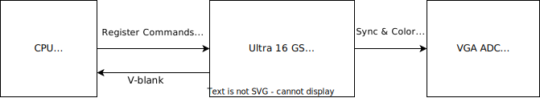

# Ultra 16 Graphics Synthesizer Design Document

## Identification

This document describes the overall design of the Ultra 16 Graphics Synthesizer.
The Ultra 16 is a toy 2-D gaming platform created for experimentation with graphics rendering using the ICE40UP5K FPGA.

## Introduction

The graphics synthesizer is a scan line output VGA 2-D graphics rendering engine.
It produces a 12-bit VGA signal that is fed through a resistor ladder to produce a VGA signal.

### Context

#### Prototype Hardware

